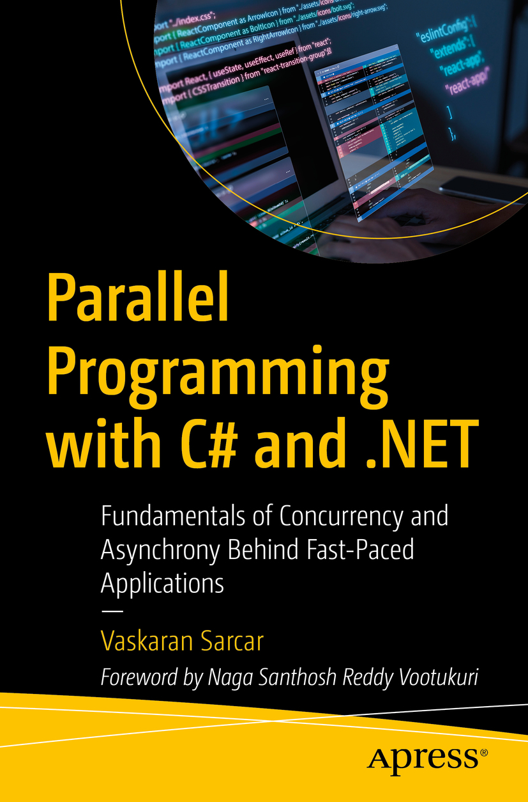

# Apress Source Code

This repository accompanies [*Parallel Programming with C# and .NET*](https://link.springer.com/book/9798868804878) by Vaskaran Sarcar (Apress, 2024).

[comment]: #cover


Download the files as a zip using the green button, or clone the repository to your machine using Git.

## Prerequisites

To successfully run the samples and solutions from this book, please ensure you have the following tools and dependencies installed on your system:

Here is a template for the prerequisites section of the GitHub README page for your book's repository:

---

# Prerequisites

To successfully run the samples and solutions from this book, please ensure you have the following tools and dependencies installed on your system:

## 1. .NET SDK

- **.NET 8.0 SDK**: Download and install the .NET 8.0 SDK from the official [.NET website](https://dotnet.microsoft.com/download/dotnet/8.0).
  - Ensure that the installation was successful by running the following command in your terminal or command prompt:
    ```bash
    dotnet --version
    ```
  - This should output the version number, confirming the installation.

## 2. Visual Studio IDE

- **Visual Studio 2022**: Download and install Visual Studio 2022 from the official [Visual Studio website](https://visualstudio.microsoft.com/).
  - During the installation, ensure you select the following workloads:
    - **ASP.NET and web development**
    - **.NET Core cross-platform development**
  - Optionally, you may also want to install other workloads based on your choice

## 3. Additional Tools

- **Git**: Download and install Git from the official [Git website](https://git-scm.com/).
  - Verify the installation by running:
    ```bash
    git --version
    ```

## 4. Cloning the Repository

- Clone the repository to your local machine using the following command:
  ```bash
  git clone https://github.com/Apress/Parallel-Programming-with-CSharp-and-.NET.git
  ```

## 5. Setting Up the Environment

- Open the cloned repository in Visual Studio 2022.
- Restore the NuGet packages by building the solution (usually done automatically by Visual Studio).
- Ensure that all projects build successfully before running any sample.

## 6. Running the Samples

- Open individual projects solution files and run the code samples.
- Use Visual Studio's debugging and build tools to run and test the samples as described in the book.

---
## Releases

Release v1.0 corresponds to the code in the published book, without corrections or updates.

## Contributions

See the file Contributing.md for more information on how you can contribute to this repository.
